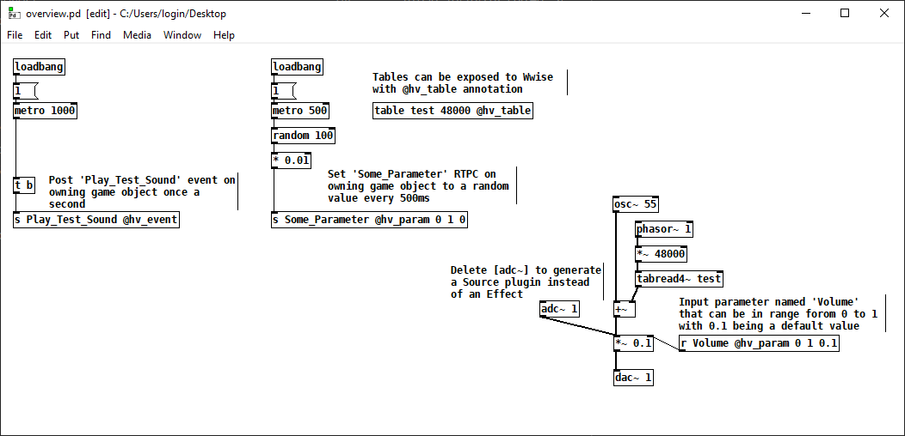

# Wwise

## Version Support

`hvcc` will generate a Wwise plugin project that can be built with Audiokinetic's build system, see [Using the Development Tools](https://www.audiokinetic.com/en/library/edge/?source=SDK&id=effectplugin_tools.html). This system can generate project files for all supported platforms, as well as package the plugin for distribution with Wwise Launcher. Please refere to the official documentation for more details.

To build Authoring and Engine plugins on Windows you'll need:

- Visual Studio 2019 or 2022 with the following components installed:
  - Desktop development with C++ workload
  - C++ MFC
  - C++ ATL
  - Windows 10 SDK (10.0.19041.0)
    - Different version can be specified in a generated
      PremakePlugin.lua file
- Wwise 2022
  - Version 2021 should work, too, but it wasn't tested
  - SDK with required deployment platforms must be installed through
    Wwise Launcher

## Feature Overview

Heavy currently supports the following Wwise features:

- Source or Effect plugins
- Using uncompressed audio to build samplers
- Input parameters are RTPC-controllable
- Output parameters can set RTPC in Wwise
- Output events can post arbitrary events in Wwise from the plugin



## Source Generator or FX Unit

The type of plugin that **heavy** generates is dynamically determined depending on the [I/O channel configuration](02.getting_started.md#audio-input-output).

If an `[adc~]` object exists in the patch the generated plugin with be an FX unit. Otherwise it'll be a source generator plugin.

## RTPCs

The Wwise target supports both [input and output parameters](02.getting_started.md#exposing-parameters).


### Input Parameters

Exposing an input parameter will automatically generate a Slider UI in the plugin interface, that can then be connected to RTPCs from your game.

### Output Parameters

Sending a `single float value` to an output parameters will in turn cause the corresponding RTPC of the same name to be set. It will be set on the same game object.

**Note**: it's important that the naming of the output parameter and the global RTPC set up in Wwise are exactly the same.

The example patch below describes a simple envelope follower that can be used to modulate other parameters of the same voice:


### Posting Wwise Events from the Plugin

Sending any message to an output event will post a Wwise event with the same name on the same game object. This can be used, for example, to trigger events in Wwise in response to RTPC changes, or to implement a generative event triggering system.

## Building and Installation

Heavy generates a project compatible with Audiokinetic' [Development Tools](https://www.audiokinetic.com/en/library/edge/?source=SDK&id=effectplugin_tools.html). They are thoroughly documented, so we'll only provide one example.

**Important:** Please close any running Wwise Authoring instance as it'll prevent the plugin from being built.

Change into the generated directory:

```cmd
cd heavy_out_dir\wwise
```

Generate Visual Studio project files; note, WWISEROOT environment variable can be set from Wwise Launcher by clicking on *Set Environment Variables* button in front of an installed Wwise entry:

```cmd
python %WWISEROOT%\Scripts\Build\Plugins\wp.py premake Authoring
python %WWISEROOT%\Scripts\Build\Plugins\wp.py premake Windows_vc160
```

Build Authoring and Engine plugins in Release configurations; for Visual Studio 2022 replace vc160 with vc170:

```cmd
python %WWISEROOT%\Scripts\Build\Plugins\wp.py build -c Release -x x64 -t vc160 Authoring
python %WWISEROOT%\Scripts\Build\Plugins\wp.py build -c Release -x x64 -t vc160 Windows_vc160
```

At this point the plugins should be already in the correct SDK directories and be ready for use in the Authoring app. We can go a step further and package the plugins into a bundle that can be installed conveniently from Wwise Launcher:

```cmd
python %WWISEROOT%\Scripts\Build\Plugins\wp.py package --version 2022.1.0.1 Authoring
python %WWISEROOT%\Scripts\Build\Plugins\wp.py package --version 2022.1.0.1 Windows_vc160
python %WWISEROOT%\Scripts\Build\Plugins\wp.py generate-bundle --version 2022.1.0.1
mkdir Bundle
copy /y bundle.json Bundle
copy /y *.tar.xz Bundle
```

You can now install the plugin in Wwise Launcher, see Wwise Version -> Manage Plug-ins -> Install from directory / Install from archive.
